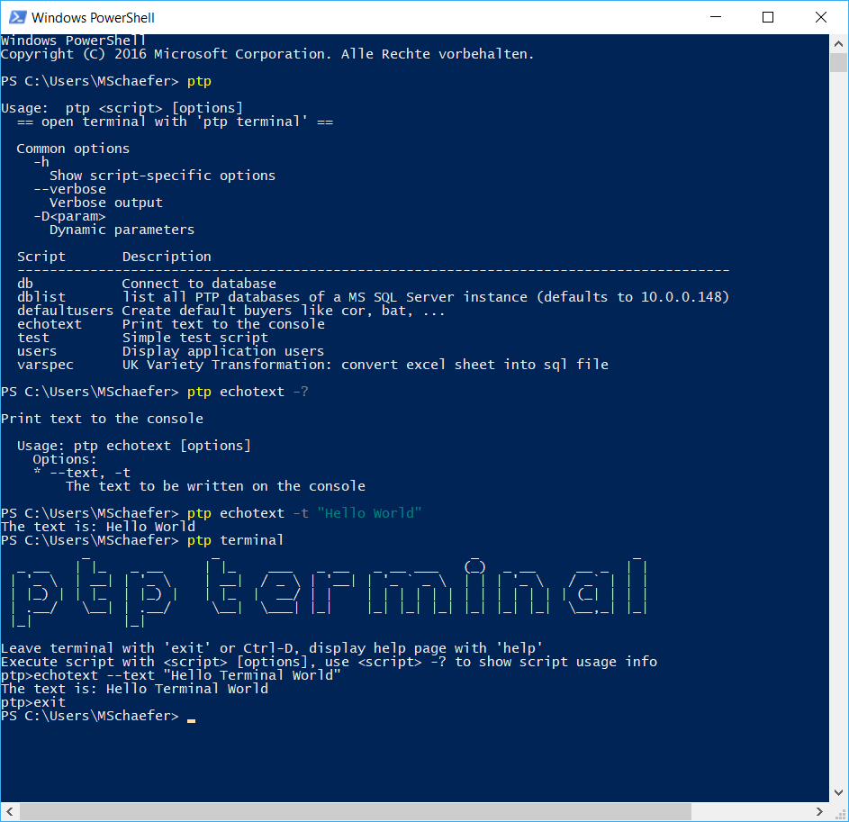

# GSH - Groovy Shell

Groovy ist die natürliche Skriptsprache für Java Entwickler. Und vermutlich gibt es in jedem Projekt einige kleinere Tasks, die sich gut mit Groovy automatisieren ließen. Warum sind Groovy Skripte dann in freier Wildbahn so selten anzutreffen? Vielleicht ist ein Grund der mangelnde Komfort beim Verwalten und Ausführen der Skripte. GSH springt an dieser Stelle aus dem Busch und rollt den roten Teppich aus.   

## Installation

1. Projekt klonen mit `git clone ...`
2. Projekt bauen mit `mvn clean package`. Die Distribution liegt im *target* Verzeichnis
2. Ein neues Verzeichnis mit zwei Unterverzeichnissen /src und /bin erstellen.
2. Die GSH Distribution in das neue Verzeichnis kopieren, so dass die GSH Batchdatei unter diesem Pfad zu finden ist: <folder>/gsh/bin/gsh.bat
3. Eine individuelles Startscript (z.B. prjx.bat) im /bin Verzeichnis erstellen. Eine Vorlage inklusive Kommentaren zur Anpassung wird in der Distribution mitgeliefert.  

In der Regel wird das Verzeichnis in ein GIT Repository eingecheckt werden, damit auch andere etwas davon haben. Eine Installation von Groovy ist nicht notwendig. Im folgenden gehe ich davon aus, dass das *bin* Verzeichnis im Pfad aufgenommen ist. Dann kann man von einem beliebigen Ort das Tool mit *prjx ...* starten.  

## Skript erstellen

Von GSH ausgeführte Groovy Skripte unterscheiden sich im Wesentlichen nicht von den Skripten wie man sie mit *groovy -e* ausführt. Ein Unterschied sind die //! Kommentare. Diese werden bei der Auflistung der Skripte als Beschreibung verwendet. 

Der erste Buchstabe muss kleingeschrieben sein um die .groovy Datei für GSH als Skript zu kennzeichnen. Alle .groovy Dateien im src Verzeichnis werden vom Groovy Classloader geladen. Eine .groovy Datei mit großen Anfangsbuchstaben kann z.B. eine Hilfsklasse enthalten.   

Eclipse und IntelliJ bieten Unterstützung beim Editieren von Groovy Skripten an. Mit der IntelliJ Community Edition kann man z.B. ein Groovy Projekt einrichten mit den eingebundenen Jars als Library. So kann die IDE eine für eine Skriptsprache beachtlichen Support bieten.   

## Skript ausführen

Die Eingabe von *prjx* auf der Kommandozeile zeigt einige grundsätzliche Informationen und eine Liste aller im Verzeichnis *src* liegender Skripte.
Falls es ein Script namens *test.groovy* gäbe, würde man es mit *prjx test* ausführen.

## Zusätzliche Libraries verwenden

Einfach ein neues Verzeichnis *lib* erstellen und die JAR Dateien reinkippen.

## Parametrisierung

Die Parametrisierung der Skripte basiert auf der JCommander-Bibliothek. Daher ist alles, was in deren Dokumentation steht, wahr. Der Skripteschreiber muss sich nur um die Parameterannotationen kümmern, die Auswertung der Argumente übernimmt GSH. Der einzige Unterscheid zur Verwendung der Lib in Java ist, dass in einem Groovy Skript ein Feld mit der Annotation @Field gekennzeichnet werden muss, damit Groovy es bei der Konvertierung zur Klasse zu einem Feld der Klasse macht. Ohne die Annotation würde es als Variable im Konstruktor enden und für JCommander unsichtbar bleiben.  

## Terminal Modus

Der Aufruf von der Kommandzeile dauert einige Zeit, da jedesmal die Java VM startet. Das lässt sich beschleunigen, indem man mit *prjx terminal* eine Kommandozeile innerhalb der VM aufmacht. Tab completion steht dann für den Skriptnamen zur Verfügung. Mit den Cursortasten kann man in der Kommandohistorie blättern. Im Terminal Modus sind keine Systemkommandos ('dir') ausführbar. Beim Starten des Terminal Modus gibt GSH freundliche Hinweise über die verfügbaren Kommandos. 

## Beispiel

/src/echotext.groovy

    //! Print text to the console
    import com.beust.jcommander.Parameter
    import groovy.transform.Field
    
    @Field @Parameter(names = ["--text", "-t"], description = "The text to be written on the console", required = true)
    String text;
    
    println "The text is: " + text

Session

## Known Limitations/Bugs

* Geht noch nicht auf Linux

